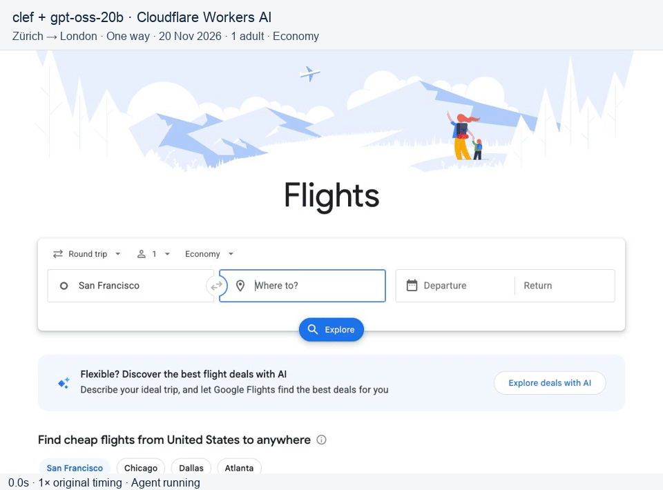

# Browser Use Clef-Flash

An independent adaptation of [browser-use/jev-ultrafast](https://github.com/browser-use/jev-ultrafast) using [Cloudflare-hosted Clef](https://developers.cloudflare.com/workers-ai/models/clef/) for browser decisions. This fork is not maintained or endorsed by Cloudflare or Browser Use. Maintained by [Sid Mohan](https://github.com/sidmohan0). The distribution is `browser-use-clef-flash`; Python imports (`jev_ultrafast`) and the CLI (`jev`) retain their upstream names for compatibility.

**A browser agent with a dynamic, indexed action space.**

Give it one goal. Clef picks an operation and an element. Cloudflare-hosted GPT-OSS 20B writes text only when the operation is `TYPE_TEXT`. The default is **Clef (27B) + GPT-OSS 20B with low reasoning**, the configuration used in the verified Flights run. Set `CLEF_MODEL=clef-flash` to opt into the smaller decision model. The repository name is retained.

**Verified Cloudflare demonstration:** Zürich → London in 30.448 seconds using Clef + GPT-OSS 20B. See the [matched provider comparison](#matched-jev--cloudflare-comparison) for repeated measurements and limitations.

<a href="docs/cloudflare-flights.mp4"></a>

[Watch the MP4](docs/cloudflare-flights.mp4) · [Verification](docs/cloudflare-flights.md) · [Read the loop](jev_ultrafast/agent.py)

## The action space

Every observation produces a new element table:

```text
[1] button    Change ticket type · Round trip
[2] combobox  Where from?        · San Francisco
[3] combobox  Where to?          · empty
[4] textbox   Departure          · empty
...
```

The operations are `CLICK`, `TYPE_TEXT`, `SELECT`, `SCROLL_UP`, `SCROLL_DOWN`, `WAIT`, `DONE`, and `BLOCKED`. Only supported operations and targets are offered.

```text
                      one Clef request
                     ┌───────────────────────────┐
page → element table → operation                 │
                     │ click_target              │
                     │ type_text_target          │
                     │ select_target, if present │
                     └─────────────┬─────────────┘
                         use the matching target
                                   │
                    CLICK [7] ─────┤──→ browser
                TYPE_TEXT [3] ─────┘
                          ↓
                   small LLM → text → browser
```

Target questions are speculative. If the operation is `CLICK`, only `click_target` can execute. Two decisions, **one network round trip**. Each target head contains only compatible elements. Clef requires at least two choices per question: when an operation has exactly one observed target, that target is determined locally after Clef selects the operation and still passes the existing validator and browser guards. Its reported target probability/confidence is deterministic (1.0), not a model estimate. Native dropdown choices carry an observed element/option index.

There are no site-specific action scripts or prepared field strings in the policy. The Flights example supplies a goal and independently verifies the outcome. The screenshot renderer adds labels afterward; it does not drive the browser.

## Try it

```bash
git clone https://github.com/sidmohan0/browser-use-clef-flash.git
cd browser-use-clef-flash
uv sync
cp .env.example .env
# Add CLOUDFLARE_ACCOUNT_ID and CLOUDFLARE_API_TOKEN.
uv run jev
```

Open **http://127.0.0.1:8766** and click **Start demo → Run automatically**. The inspector shows numbered elements, operation probabilities, target probabilities, and executed actions. **Choose next** pauses before execution.

Chrome connects through [Browser Harness](https://github.com/browser-use/browser-harness), installed by `uv sync`. Run `uv run browser-harness --doctor` if it needs connecting. Allow remote debugging in Chrome when prompted.

Text entry defaults to [Cloudflare-hosted GPT-OSS 20B](https://developers.cloudflare.com/workers-ai/models/gpt-oss-20b/) with `reasoning_effort: low` and JSON-object output. It reuses `CLOUDFLARE_API_TOKEN` and derives the account’s `/ai/v1/chat/completions` endpoint. No separate text-provider key is needed.

`TEXT_MODEL`, `TEXT_MODEL_BASE_URL`, `TEXT_MODEL_API_KEY`, and `TEXT_MODEL_REASONING` remain configurable. A custom endpoint requires its own explicit text key; the Cloudflare token is never forwarded to another endpoint. `TEXT_MODEL_REASONING=omit` omits reasoning parameters, `none` sends `reasoning.enabled=false`, and `low`/`medium`/`high` set the requested effort (`reasoning_effort` on Cloudflare). Other providers must support the actual JSON-output and reasoning request; universal compatibility is not claimed.

### Cloudflare access

In your Cloudflare account, create an API token with **Account → Workers AI → Read**, restricted to that account. Copy its account ID and token to the local ignored `.env`; never commit credentials. See the [REST API setup guide](https://developers.cloudflare.com/workers-ai/get-started/rest-api/). No Worker deployment or model download is required.

Decisions use `POST https://api.cloudflare.com/client/v4/accounts/{CLOUDFLARE_ACCOUNT_ID}/ai/run/@cf/cloudflare/{CLEF_MODEL}`, bearer authentication, and a matching model selector (`clef` by default, or `clef-flash`). The decision path unwraps the REST `success`/`result` envelope and passes the model answers through the existing operation/target validator. Missing credentials, provider errors, and malformed or invalid decisions stop before browser execution. Text-helper response parsing, browser freshness guards, and retries remain unchanged.

Workers AI usage is subject to your account’s plan and [Cloudflare pricing](https://developers.cloudflare.com/workers-ai/platform/pricing/). Both decisions and text entry use this Cloudflare account by default.

## Use the library

```python
from jev_ultrafast import Agent

with Agent(
    "https://www.google.com/travel/flights?hl=en",
    "Find one-way flights from Zurich to London on November 20, 2026, "
    "for one adult in economy. Stop when matching flight options are visible.",
) as agent:
    for state in agent.run():
        print(state["elapsed_ms"], state["status"])
```

Run with `uv run --env-file .env python your_script.py`. The same policy can run a different task:

```bash
uv run --env-file .env python examples/run.py \
  --url https://en.wikipedia.org/wiki/Main_Page \
  --goal 'Find and open the Wikipedia article about Gödel’s incompleteness theorems.'
```

`uv run --env-file .env python examples/flights.py --keep-open` performs the flight search, checks the actual route/date/results, and saves its trace. It does not select or book a flight.

## Why it moves

- **One request per decision cycle.** Operation and target heads share the same observed state.
- **No screenshots in the default agent loop.** Clef consumes structured state. The inspector opts into screenshots; the video uses a separate continuous screencast.
- **One browser call per snapshot.** Read visible controls, their names, values, and text atomically. Keep references to the actual DOM nodes.
- **Validate the selected target.** Clicks check the document, form values, target, and nearby context. Animation alone does not force another prediction. Resolve current geometry and reject covered controls before input.
- **Wait for useful state.** After typing into a combobox, wait for visible suggestions, capped at 200 ms. Other interactions get at most two animation frames or 50 ms. These reads happen after execution is logged.
- **Keep hidden tabs rendering.** Focus emulation prevents background animation throttling without switching Chrome's visible tab.
- **Send visible text.** Offscreen article bodies and footers do not fill the model context.
- **Reuse an interrupted text request.** A generated value survives a stale-page retry only if the entire text-helper input is unchanged.

Every executed target is resolved from an observed node. The executor rechecks page freshness and click occlusion. Model output never becomes selectors, coordinates, shell commands, or executable JavaScript. Text-helper output must parse as a small JSON object before typing.

## Small enough to read

| File | Job |
| --- | --- |
| [agent.py](jev_ultrafast/agent.py) | The complete loop and text-helper handoff |
| [snapshot.js](jev_ultrafast/snapshot.js) | Atomic DOM snapshot, indexed controls, freshness guards |
| [browser.py](jev_ultrafast/browser.py) | Browser connection, current geometry, execution |
| [model.py](jev_ultrafast/model.py) | Dynamic operation/target heads and text generation |
| [questions.py](jev_ultrafast/questions.py) | Model instructions |
| [demo.py](jev_ultrafast/demo.py) | Local inspector |

## Verified Cloudflare Flights run

**Clef (27B) + GPT-OSS 20B**, October 4, 2026: Zürich/ZRH → London, one way, **November 20, 2026**, one adult, economy. The agent reached matching results in **30.448 seconds**, with 25 decisions, 18 executed actions, and two model-generated text entries. Fresh page data independently verified route, date/year, passenger count, cabin, and flight results. This is one recorded success, not a reliability benchmark.

[MP4](docs/cloudflare-flights.mp4) · [Verification and failed attempts](docs/cloudflare-flights.md)

Clef-Flash did not complete this task in the recorded attempts, so Clef is now the default. The November date replaces the upstream September date, which was already past when tested.

```bash
uv run --env-file .env python scripts/record_flights.py artifacts/flights/my-run
uv run python scripts/render_recording.py artifacts/flights/my-run --output artifacts/flights/my-video
```

Rendering requires FFmpeg and uses the macOS Arial font. It retains original timing and loading waits, adds a one-second final hold, and does not overwrite upstream media.

## Findings from the integration

These observations were recorded on October 4, 2026, using an isolated headless Chrome profile on macOS and Browser Harness 0.1.13.

| Configuration or change | Observed result | Decision |
| --- | --- | --- |
| Llama 3.1 8B FP8 text helper | Returned the origin for a destination probe after passing the origin probe. | Use GPT-OSS 20B with low reasoning; it generated both city names correctly in the successful live run. |
| Clef-Flash decision model | Two runs became stuck in the multi-airport picker. A third filled both cities but repeatedly selected WAIT at London's suggestions until the existing 60-action limit. | Keep it available as an opt-in; use Clef by default. |
| Goal included directly in shared state | Corrected the saved origin-picker choice. Converting instructions or option descriptions to plain text did not fix that saved decision. | Retain the goal in state and cover its presence with an offline request test. This did not make Clef-Flash complete the task. |
| Clef (27B) + GPT-OSS 20B | Completed the recorded Flights search in 30.448 seconds, with 25 decisions, 18 actions, and two text generations. | Adopt this configuration as the default. |
| Independent outcome verification | Google's origin label included “Zürich ZRH”; the old exact-label check rejected the correct result. | Accept the airport suffix while checking the origin value; also verify passenger count and economy cabin. All nine final checks passed. |

Cloudflare's REST response needs its `success`/`result` envelope normalized before choice validation. A live HTTP 422 also established that a choice question needs at least two options: a sole observed target is resolved only after the operation is selected, then still validated. Both inference paths reuse an account-scoped **Workers AI: Read** token; no Worker deployment or second provider key is required.

The successful recording includes original timing and loading waits. No site-specific action plan, prepared field values, flight booking, or browser-guard bypass was used. Failed attempts and the original verifier result were preserved in local ignored artifacts; [the verification record](docs/cloudflare-flights.md) documents them. **One successful run does not establish general reliability or prove a speed advantage over upstream.** The upstream demonstration used a different model and an earlier travel date, so its 7.1-second result is not a controlled comparison.

## Matched Jev / Cloudflare comparison

On October 4, 2026, six additional Flights runs used the same goal (November 20), application loop, questions, guards, and Cloudflare GPT-OSS 20B text helper. Each run used a fresh isolated headless Chrome profile and one excluded decision warmup. Provider order was Jev, Clef, Clef, Jev, Jev, Clef. A benchmark-only adapter selected Jev 1.13.0; production remains Cloudflare-oriented. Timing starts after initial observation and excludes startup, warmup, and final independent verification. No recording was enabled.

| Decision provider | Verified runs | Completion times | Median | Executed WAITs per run |
| --- | --- | --- | --- | --- |
| Jev 1.13.0 | 3/3 | 5.238 s, 6.729 s, 5.046 s | **5.238 s** | 1, 2, 3 |
| Cloudflare Clef | 3/3 | 26.513 s, 26.847 s, 25.178 s | **26.513 s** | 8, 8, 8 |

Clef took 5.06× as long by median in this small matched sample. Separate replay of three identical saved states/questions, four measured repetitions each after an initial excluded request per provider, measured these median request latencies:

| Saved state | Jev 1.13.0 | Clef | Clef-Flash |
| --- | --- | --- | --- |
| Homepage | 119 ms | 1,016 ms | 372 ms |
| Calendar | 172 ms | 1,376 ms | 520 ms |
| Ready to search | 146 ms | 867 ms | 386 ms |

All replay calls used HTTP/2 and persistent clients. Clef's measured replay calls required no reconnects; the delay was predominantly awaiting response headers, not transmitting the request or reading the body. A 10.968-second Clef calendar outlier is retained in the measurements. On the frozen ready-to-search state, Jev selected CLICK in 4/4 calls and Clef WAIT in 4/4. Flash's faster replay does not override its earlier live task failures.

Jev also uses an [HTTPS JSON REST endpoint](https://docs.typesafe.ai/api). These results do not isolate Cloudflare REST gateway overhead from routing, queueing, or inference. TypeSafe describes a [specialized architecture and parallel sampler, with service based on the West Coast](https://typesafe.ai/blog/introducing-system-one-models-and-jev); the sources reviewed do not specify its GPU hardware or serving implementation. Comparing the same Clef model through REST and a Worker AI binding would be a separate experiment. Three runs per provider on one live task do not establish general reliability. [Measurement data and boundaries](docs/provider-comparison.json).

## Evidence and limits

This fork’s [Clef verification record](docs/clef-verification.md) covers the live REST boundary, independently verified navigation, offline tests, and the initial navigation-only result. Run `uv run --env-file .env python scripts/smoke_navigation.py` to repeat the navigation check with a connected browser. This calls Cloudflare; it is not part of the offline suite.

All timings in this section and the linked historical performance documents are **upstream TypeSafe/Jev results**, not Clef-Flash benchmarks. The upstream video is a **7,073 ms** Google Flights run. Timing starts after initial page observation and includes model calls, generated text, browser work, stale decisions, and loading waits. A fresh independent check verifies the one-way setting, Zürich, London, September 20, 2026, and visible flight options. The video plays at 1×, with no opening hold and a 0.5-second final hold.

In six alternating runs with identical models and settings, both versions passed **3/3**. Median task time went from **9.450 s → 7.092 s**, a **25% reduction**; median browser protocol calls went from **1,092 → 101**. This is three repeats of one task on one browser profile, not a general reliability benchmark.

The same policy opened the requested Wikipedia article in **2.798 s** and passed a local hotel search/filter task in **1.896 s**. Runs, failures, source hashes, and measurement boundaries are in [performance.md](docs/performance.md).

A `DONE` choice still requires independent outcome verification. The DOM reader handles common HTML and ARIA controls, not the full accessible-name specification. Shadow roots, frames, canvas, uploads, pop-up tabs, nested scrolling, and arbitrary keyboard widgets remain outside this MVP. Owned tabs share the existing Chrome profile.

## Contributing

See [CONTRIBUTING.md](CONTRIBUTING.md) for setup, checks, and benchmark reporting expectations. Report bugs and propose changes in [this fork’s issue tracker](https://github.com/sidmohan0/browser-use-clef-flash/issues).

## Development

```bash
uv run ruff check .
uv run pytest
node --check jev_ultrafast/static/app.js
node --check jev_ultrafast/snapshot.js
uv build
```

Tests are offline. `uv run python scripts/check_guards.py` checks real controls in a local browser without model calls. Live examples and recording scripts make paid API calls. `scripts/record_flights.py <new-folder>` captures original browser timestamps; `scripts/render_demo.py <recording-folder>` renders that verified run at 1× and crops out the Google account strip. Credentials and raw traces stay ignored.

---

[Browser Use](https://github.com/browser-use/browser-use) · [Browser Harness](https://github.com/browser-use/browser-harness) · [TypeSafe speculative fan-out](https://docs.typesafe.ai/patterns/fan-out)

## License

The application is licensed under [MIT](LICENSE), with the original Browser Use copyright retained and Sid Mohan credited for fork modifications. See [ATTRIBUTION.md](ATTRIBUTION.md) for upstream provenance, retained demonstration assets, and external model licenses. Model weights are not distributed in this repository; hosted services have their own terms.
